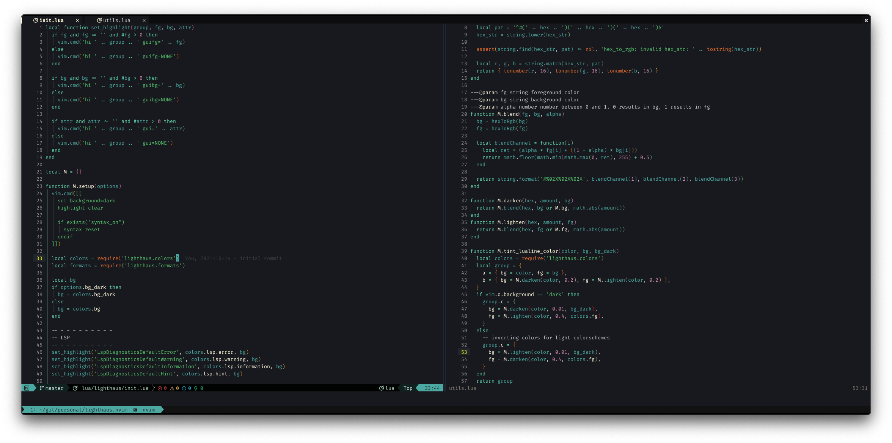
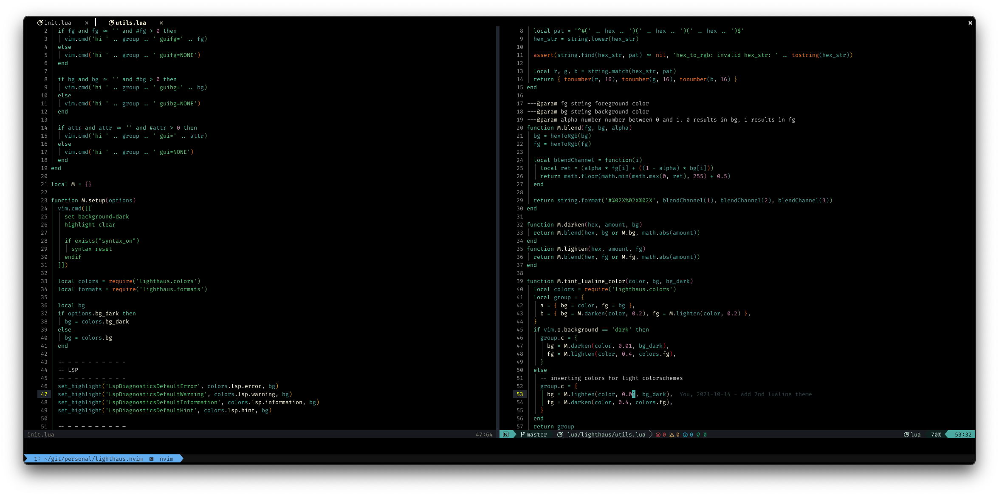

# lighthaus.nvim

A Lua implementation of [lighthaus-theme/vim-lighthaus](https://github.com/lighthaus-theme/vim-lighthaus), with added built-in LSP support!

Default:



Dark:



**NOTE:** Requires `termguicolors`.

## Config

Running `:colorscheme lighthaus` will set the theme with the default background. Otherwise, see configuration below.

```lua
require('lighthaus').setup({
  -- set true to use dark bg by default
  bg_dark = false,
  -- see colors.lua to see colors table, set overrides here to be merged with defaults
  colors = {},
})
```

## Lualine Themes

There's 2 Lualine themes, 'lighthaus', and 'lighthaus_dark'. The 'lighthaus_dark' Lualine looks better when
using `bg_dark = true`. Lualine must be loaded _after_ Lighthaus.

Setup:

```lua
require('lualine').setup({
  options = {
    -- your other options here
    theme = 'lighthaus', -- or theme = 'lighthaus_dark'
  },
  -- your other lualine config here
})
```

## Terminal Themes

A theme for Kitty can be found in `extra/`. Feel free to submit a PR to add a theme for your favorite editor.
